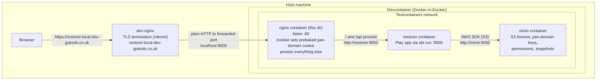

# Local dev / e2e container stack

These images make up the containerised Restorer stack used by the e2e suite and
by `npm run dev:local`. They are orchestrated by
[`../setup/stackContainers.ts`](../setup/stackContainers.ts) via Testcontainers.

## How traffic flows

## Key points

- **TLS is terminated once, by the host's `dev-nginx`.** It serves the trusted
  `restorer.local.dev-gutools.co.uk` domain and proxies **plain HTTP** to the
  container, so the local nginx listens on `:80` (not `:443`).
- The devcontainer publishes the nginx container's port `80` to host port `9000`
  (fixed for `dev:local`; dynamic in the e2e suite). `dev-nginx` proxies to that
  port.
- **`/cookie`** is served same-origin with the app. It returns a prebaked
  pan-domain auth cookie (generated from the static local test key at image build
  time — see [`generate-pan-domain-cookie.ts`](./generate-pan-domain-cookie.ts))
  and redirects to `/`, giving an authenticated session without the real OAuth
  flow.
- The **restorer** container talks to **minio** over the Testcontainers network
  for its S3 dependencies (pan-domain settings/keys, permissions, snapshots).

## Files

| File | Purpose |
| --- | --- |
| [`restorer.Dockerfile`](./restorer.Dockerfile) | Builds and runs the Play app (`entrypoint.dev.sh`). |
| [`minio.Dockerfile`](./minio.Dockerfile) | MinIO with buckets/fixtures seeded by `start-minio-with-buckets`. |
| [`nginx.Dockerfile`](./nginx.Dockerfile) | nginx proxy + `/cookie`, with the cookie baked in at build time. |
| [`nginx-dev.conf.template`](./nginx-dev.conf.template) | nginx server config; the cookie token is templated in via `envsubst`. |
| [`generate-pan-domain-cookie.ts`](./generate-pan-domain-cookie.ts) | Build-time cookie generator reusing the project's cookie helper. |
| [`entrypoint.dev.sh`](./entrypoint.dev.sh) | Restorer container entrypoint (webpack watch + `sbt run`). |
| [`run-dev-local.ts`](./run-dev-local.ts) | `npm run dev:local` — starts the stack and keeps it running. |
